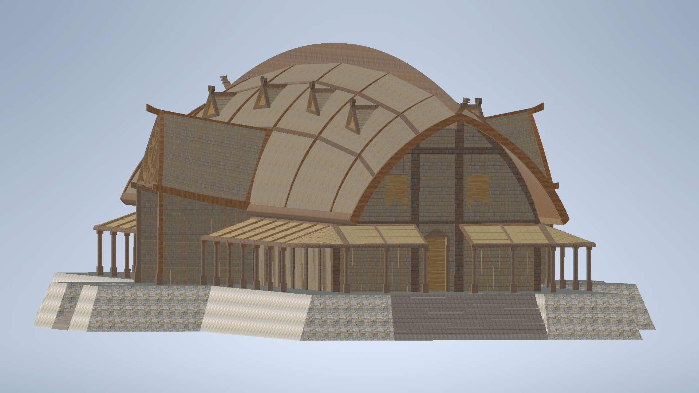

# Project for Autodesk Inventor

* **Intent**: Building Creation
* **Idea**: Viking Longhouse Building
* **Required Models**:
  1. Roof
  2. Beams or Walls
  3. Doors

* **Rating**:
  1. Using 10 functions in Inventor (15%)
  2. Include 3 pictures in different angles for the product (15%)
  3. Include 3 exploded views of the work (15%)
  4. Including three main parts: roof, beams or walls, doors (15%)
  5. Reporting time for 8 minutes (10%)
  6. Creative ideas: Clarity, Intention, and Core Idea (10%)
  7. Creativity and Originality: design, style... (20%)

* **Final Model**: "Longhouse.iam"
* **Link**: [Inventor_Project](https://github.com/William-HuangWY/Inventor_Project.git)

---

### Preview of Longhouse Model

